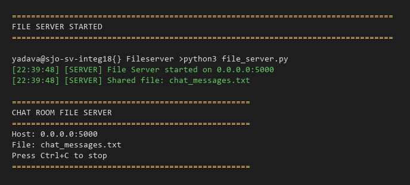
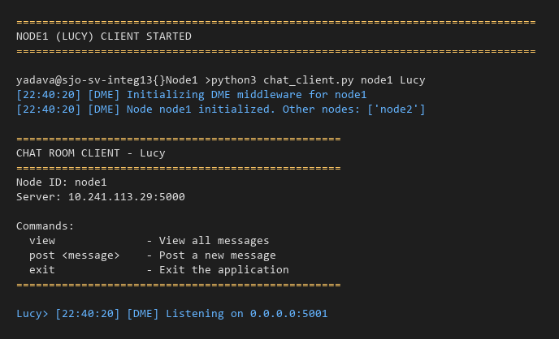
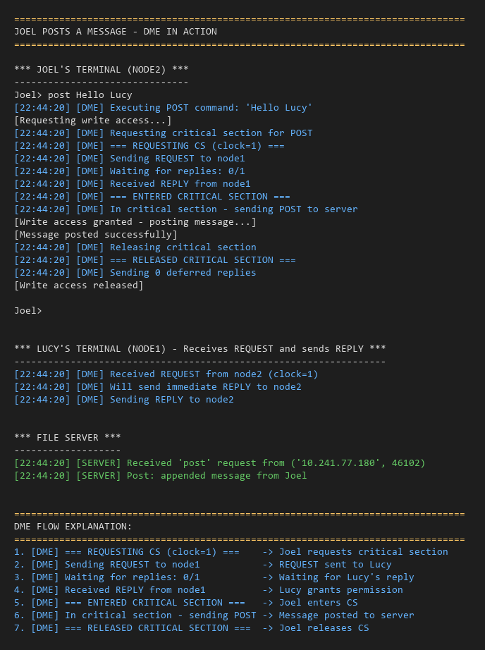
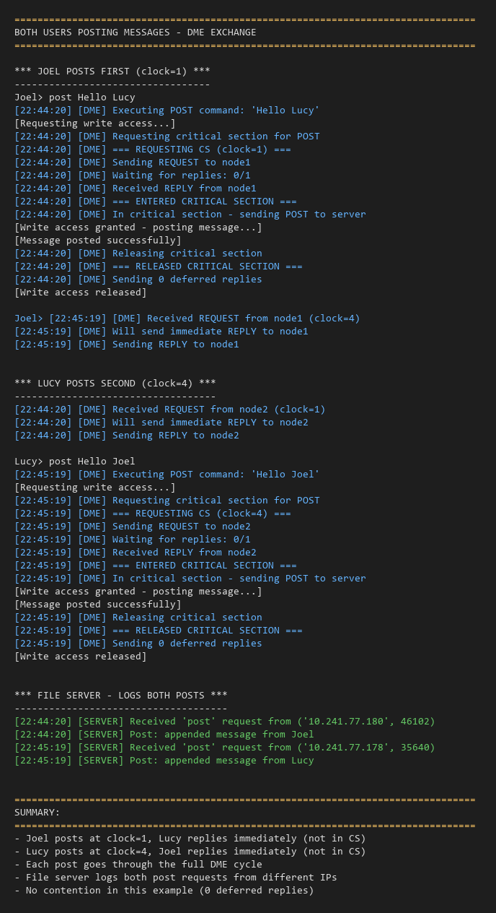
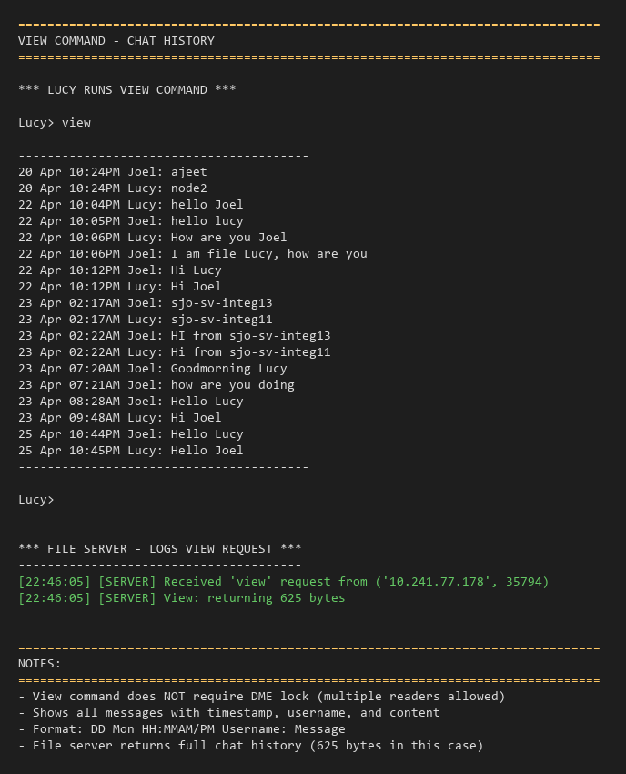

# Distributed Chat Room System

A 3-node distributed system implementing a chat room with Distributed Mutual Exclusion (DME) using Ricart-Agrawala algorithm.

## Architecture

```
+----------------+     +----------------+
|    Node 1      |     |    Node 2      |
|  (Chat Client) |<--->|  (Chat Client) |
|  + DME Layer   |     |  + DME Layer   |
+-------+--------+     +--------+-------+
        |                       |
        |    Ricart-Agrawala    |
        |    DME Protocol       |
        |                       |
        v                       v
+---------------------------------------+
|           File Server (Node 3)        |
|         (Shared Chat File)            |
+---------------------------------------+
```

## Components

| File | Description |
|------|-------------|
| `file_server.py` | File server node maintaining shared chat file |
| `dme_middleware.py` | Ricart-Agrawala DME algorithm implementation |
| `chat_client.py` | Chat application using DME middleware |

## Commands

| Command | Description |
|---------|-------------|
| `view` | View all messages (no lock needed, multiple viewers allowed) |
| `post <message>` | Post a message (requires DME lock) |
| `exit` | Exit the application |

---

## Running on Single Machine (localhost)

### Step 1: Update Configuration in `chat_client.py`

```python
SERVER_IP = 'localhost'
NODE1_IP = 'localhost'
NODE2_IP = 'localhost'
```

### Step 2: Start Services (3 separate terminals)

**Terminal 1 - File Server:**
```bash
python file_server.py
```

**Terminal 2 - Node1 (Lucy):**
```bash
python chat_client.py node1 Lucy
```

**Terminal 3 - Node2 (Joel):**
```bash
python chat_client.py node2 Joel
```

---

## Running on Three Different Linux Servers

### Server Layout

| Server | Role | Files Needed | Port |
|--------|------|--------------|------|
| Server 1 | File Server | `file_server.py` | 5000 |
| Server 2 | Node1 Client | `chat_client.py`, `dme_middleware.py` | 5001 |
| Server 3 | Node2 Client | `chat_client.py`, `dme_middleware.py` | 5002 |

### Step 1: Copy Files to Servers

```bash
# On Server 1 (File Server)
mkdir ~/distributed_chat
# Copy file_server.py

# On Server 2 (Node1)
mkdir ~/distributed_chat
# Copy chat_client.py, dme_middleware.py

# On Server 3 (Node2)
mkdir ~/distributed_chat
# Copy chat_client.py, dme_middleware.py
```

### Step 2: Update IP Configuration

Edit `chat_client.py` on **both Server 2 and Server 3** with actual IP addresses:

```python
# ===========================================
# CONFIGURATION - UPDATE THESE IP ADDRESSES
# ===========================================
SERVER_IP = '10.241.113.29'    # IP of Server 1 (File Server)
NODE1_IP = '10.241.113.30'     # IP of Server 2 (Node1)
NODE2_IP = '10.241.113.31'     # IP of Server 3 (Node2)
```

### Step 3: Open Firewall Ports (if needed)

**Option A: firewall-cmd (CentOS/RHEL)**
```bash
# Server 1
sudo firewall-cmd --permanent --add-port=5000/tcp && sudo firewall-cmd --reload

# Server 2
sudo firewall-cmd --permanent --add-port=5001/tcp && sudo firewall-cmd --reload

# Server 3
sudo firewall-cmd --permanent --add-port=5002/tcp && sudo firewall-cmd --reload
```

**Option B: iptables**
```bash
# Server 1
sudo iptables -A INPUT -p tcp --dport 5000 -j ACCEPT

# Server 2
sudo iptables -A INPUT -p tcp --dport 5001 -j ACCEPT

# Server 3
sudo iptables -A INPUT -p tcp --dport 5002 -j ACCEPT
```

**Note:** Many internal servers don't have firewalls enabled. Try running without firewall changes first.

### Step 4: Start Services (in order)

**Server 1 - File Server:**
```bash
cd ~/distributed_chat
python3 file_server.py
```

**Server 2 - Node1:**
```bash
cd ~/distributed_chat
python3 chat_client.py node1 Lucy
```

**Server 3 - Node2:**
```bash
cd ~/distributed_chat
python3 chat_client.py node2 Joel
```

---

## DME Algorithm: Ricart-Agrawala

### How it works:

1. **Request CS:** When a node wants to POST (enter critical section):
   - Sends REQUEST message to all other nodes
   - Waits for REPLY from all nodes

2. **Handle REQUEST:** When a node receives REQUEST:
   - If not requesting/in CS: send REPLY immediately
   - If requesting: compare timestamps (lower = higher priority)
     - If own request has priority: defer REPLY
     - Otherwise: send REPLY immediately

3. **Release CS:** When releasing critical section:
   - Send all deferred REPLYs

### Logging

DME activity is logged with `[DME]` prefix to demonstrate the algorithm working:
- `[DME] === REQUESTING CS ===` - Node requesting critical section
- `[DME] Received REQUEST from nodeX` - Incoming request
- `[DME] Sending REPLY to nodeX` - Granting permission
- `[DME] === ENTERED CRITICAL SECTION ===` - Access granted
- `[DME] === RELEASED CRITICAL SECTION ===` - Access released

---

## Sample Session

**Server 1 (File Server):**
```
==================================================
CHAT ROOM FILE SERVER
==================================================
Host: 0.0.0.0:5000
File: chat_messages.txt
Press Ctrl+C to stop
==================================================

[02:15:01] [SERVER] Received 'view' request from ('10.241.113.30', 54321)
[02:15:10] [SERVER] Received 'post' request from ('10.241.113.30', 54322)
```

**Server 2 (Lucy):**
```
Lucy> post "Welcome to the team project"
[Requesting write access...]
[02:15:10] [DME] === REQUESTING CS (clock=1) ===
[02:15:10] [DME] Sending REQUEST to node2
[02:15:10] [DME] Received REPLY from node2
[02:15:10] [DME] === ENTERED CRITICAL SECTION ===
[Write access granted - posting message...]
[Message posted successfully]
[02:15:10] [DME] === RELEASED CRITICAL SECTION ===
[Write access released]

Lucy> view
----------------------------------------
23 Apr 02:15AM Lucy: Welcome to the team project
----------------------------------------
```

**Server 3 (Joel):**
```
Joel> view
----------------------------------------
23 Apr 02:15AM Lucy: Welcome to the team project
----------------------------------------

Joel> post "Thanks Lucy - hope to work together"
[Requesting write access...]
[Write access granted - posting message...]
[Message posted successfully]
[Write access released]
```

---

## Testing DME

To verify DME is working correctly:

1. Start all three services
2. Try posting from both clients simultaneously
3. Observe the `[DME]` logs showing REQUEST/REPLY messages
4. Verify only one client enters critical section at a time
5. Check `chat_messages.txt` on Server 1 for all messages

---

## Troubleshooting

| Issue | Solution |
|-------|----------|
| Connection refused | Check if server is running and IP/port is correct |
| Waiting for replies forever | Ensure all client nodes are running |
| Permission denied on port | Use port > 1024 or run with sudo |
| Firewall blocking | Open required ports or disable firewall |

---

## Usage Screenshots

### 1. File Server Started



File server running on `sjo-sv-integ18`, listening on `0.0.0.0:5000` and managing `chat_messages.txt`.

---

### 2. Node2 (Joel) Client Started


Joel's client initialized on `sjo-sv-integ13` as `node2`, connected to file server at `10.241.113.29:5000`, DME listening on port `5002`.

---

### 3. Node1 (Lucy) Client Started



Lucy's client initialized on `sjo-sv-integ13` as `node1`, connected to file server at `10.241.113.29:5000`, DME listening on port `5001`.

---

### 4. Joel Posts a Message - DME in Action



**DME Flow when Joel posts "Hello Lucy":**
1. `[DME] === REQUESTING CS (clock=1) ===` - Joel requests critical section
2. `[DME] Sending REQUEST to node1` - REQUEST sent to Lucy
3. `[DME] Waiting for replies: 0/1` - Waiting for Lucy's reply
4. `[DME] Received REPLY from node1` - Lucy grants permission
5. `[DME] === ENTERED CRITICAL SECTION ===` - Joel enters CS
6. `[DME] In critical section - sending POST to server` - Message posted
7. `[DME] === RELEASED CRITICAL SECTION ===` - Joel releases CS

---

### 5. Both Users Posting Messages



**Sequential posts demonstrating DME:**
- Joel posts at `clock=1`, Lucy replies immediately
- Lucy posts at `clock=4`, Joel replies immediately
- Each post goes through the full DME cycle
- File server logs both post requests from different IPs

---

### 6. View Command - Chat History



**Notes:**
- View command does NOT require DME lock (multiple readers allowed)
- Shows all messages with timestamp, username, and content
- Format: `DD Mon HH:MMAM/PM Username: Message`

---

## DME Algorithm Demonstrated

The screenshots show the Ricart-Agrawala algorithm working:

| Step | Node | Action | Log Evidence |
|------|------|--------|--------------|
| 1 | Joel | Request CS | `=== REQUESTING CS (clock=1) ===` |
| 2 | Joel | Send REQUEST | `Sending REQUEST to node1` |
| 3 | Lucy | Receive REQUEST | `Received REQUEST from node2 (clock=1)` |
| 4 | Lucy | Send REPLY (not in CS) | `Sending REPLY to node2` |
| 5 | Joel | Receive REPLY | `Received REPLY from node1` |
| 6 | Joel | Enter CS | `=== ENTERED CRITICAL SECTION ===` |
| 7 | Joel | Post message | `In critical section - sending POST` |
| 8 | Joel | Exit CS | `=== RELEASED CRITICAL SECTION ===` |

**Key observations:**
- Only one node in critical section at a time
- Nodes exchange REQUEST/REPLY messages
- Lamport clock increments with each operation
- Deferred replies = 0 (no contention in these examples)
